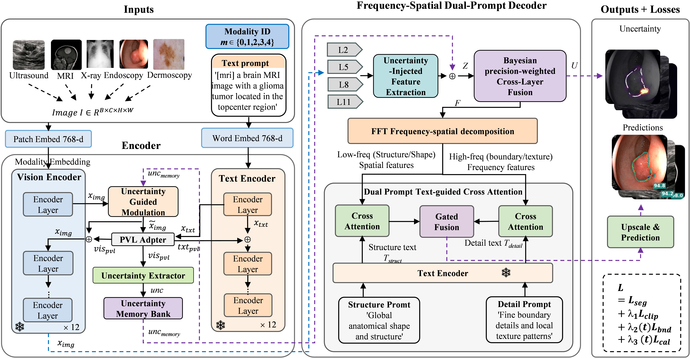

# UniMedSeg: Unified Multi-Modal Medical Image Segmentation

<div align="center">



[](https://arxiv.org)
[](LICENSE)

**[City University of Macau](https://www.cityu.edu.mo/)** | **[Putian University](http://www.ptu.edu.cn/)** | **[Florida Atlantic University](https://www.fau.edu/)**

[Jingling Zhang](mailto:D240921002700@cityu.edu.mo)<sup>1,2,3</sup>,
[Shuting Zheng](mailto:fgtear@ptu.edu.cn)<sup>2</sup>,
[Xiangfei Liu](mailto:xfliu0102@163.com)<sup>1,4</sup>,
[Wen Zhang](mailto:zhangw@fau.edu)<sup>5,6</sup>,
[Jia Gu](mailto:jiagu@cityu.edu.mo)<sup>1,†</sup>

<sup>1</sup>City University of Macau, <sup>2</sup>Putian University, <sup>3</sup>Putian Electronic Information Industry Technology Research Institute,
<sup>4</sup>Shenzhen Institute of Advanced Technology, CAS, <sup>5</sup>Florida Atlantic University, <sup>6</sup>Guangzhou Institute of Science and Technology

<sup>†</sup> *Corresponding author*

</div>

## Overview

**UniMedSeg** is a unified multi-modal medical image segmentation framework that extends [MedCLIPSeg](https://github.com/HealthX-Lab/MedCLIPSeg) with novel architectural innovations. Built upon the probabilistic vision-language foundation of MedCLIPSeg, UniMedSeg introduces four key innovations to handle diverse medical imaging modalities (ultrasound, MRI, CT, endoscopy, dermoscopy) within a single unified architecture.

> **Full Title:** *UniMedSeg: Unified Multi-Modal Medical Image Segmentation via Uncertainty-Guided Encoding and Frequency-Spatial Dual-Prompt Decoding*

> **Built on MedCLIPSeg**: This work extends the MedCLIPSeg framework (CVPR 2026) by introducing modality-aware encoding, cross-scale uncertainty propagation, frequency-spatial decomposition, and boundary-aware contrastive learning into a unified architecture.

## Key Innovations

Building upon MedCLIPSeg's probabilistic vision-language adaptation, UniMedSeg introduces:

1. **Modality-Aware Encoding**: Learnable modality embeddings that condition the model on imaging modality (ultrasound, MRI, CT, endoscopy, dermoscopy), enabling better cross-modal knowledge transfer.

2. **Cross-Scale Uncertainty Propagation**: Multi-layer uncertainty extraction and memory bank that aggregates uncertainty information across transformer layers, providing more reliable pixel-level confidence estimates.

3. **Frequency-Spatial Decomposition Decoder**: Dual-branch decoder that processes low-frequency (global structure) and high-frequency (fine details) components separately with dual-prompt cross-modal attention.

4. **Boundary-Aware Contrastive Learning**: Specialized contrastive loss that pulls boundary patches closer to text embeddings while pushing background and interior patches apart, improving boundary delineation.

## Architecture

```
Input Image + Text Prompt + Modality ID
    ↓
[CLIP Vision Encoder] ← Modality Embedding
    ↓
[PVL Adapters (MedCLIPSeg)] ← Uncertainty Extraction & Propagation
    ↓
[Frequency-Spatial Decoder]
    ├── Low-Freq Branch (structure)
    └── High-Freq Branch (details)
    ↓
[Dual-Prompt Cross Attention] ← Text Guidance
    ↓
[ScaleBlock Upsampling]
    ↓
Segmentation Mask + Uncertainty Map
```

## Results

Evaluated on **16 medical image datasets** spanning **5 imaging modalities** (same evaluation protocol as MedCLIPSeg):

### Data Efficiency (DSC %)

| Data Used | 10% | 25% | 50% | 100% |
|-----------|:---:|:---:|:---:|:----:|
| MedCLIPSeg (baseline) | 81.10 | 85.08 | 87.18 | 88.66 |
| **UniMedSeg (ours)** | **TBD** | **TBD** | **TBD** | **TBD** |

### Domain Generalization (DSC %)

| Method | In-Distribution | Out-of-Distribution | Harmonic Mean |
|--------|:---------------:|:-------------------:|:-------------:|
| MedCLIPSeg (baseline) | 89.11 | 79.02 | 83.76 |
| **UniMedSeg (ours)** | **TBD** | **TBD** | **TBD** |

*Note: Results will be updated upon completion of full evaluation.*

## Installation

```bash
# Clone the repository
git clone https://github.com/YOUR_USERNAME/UniMedSeg.git
cd UniMedSeg

# Create virtual environment
conda create -n unimedseg python=3.10
conda activate unimedseg

# Install dependencies
pip install -r requirements.txt
```

### Requirements

- Python 3.10+
- PyTorch 2.0+
- CUDA 12.0+
- See [requirements.txt](requirements.txt) for full dependencies

## Data Preparation

This project uses the same 16 datasets as MedCLIPSeg. Please follow the [MedCLIPSeg data preparation guide](https://github.com/HealthX-Lab/MedCLIPSeg/blob/main/assets/DATASETS.md) to set up the datasets:

**Datasets Used:**
- **Ultrasound**: BUSI, BUSBRA, BUSUC, BUID, UDIAT, EUS
- **MRI**: BRISC, BTMRI
- **CT**: Covid19
- **Endoscopy**: CVC300, ClinicDB, ColonDB, Kvasir, BKAI
- **Dermoscopy**: ISIC, UWaterlooSkinCancer

After preparation, organize your data as:
```
data/
├── BUSI/
├── BUSBRA/
├── BUSUC/
├── ...
└── EUS/
```

## Training

### Full Training (100% data)

```bash
python train.py \
    --config-file config_unified.yaml \
    --seed 42 \
    --output-dir ./outputs \
    --data-percentage 100
```

### Data Efficiency Training

Train with reduced data (10%, 25%, 50%):

```bash
# 50% data
python train.py \
    --config-file config_unified.yaml \
    --seed 42 \
    --output-dir ./outputs_50pct \
    --data-percentage 50

# 25% data
python train.py \
    --config-file config_unified.yaml \
    --seed 42 \
    --output-dir ./outputs_25pct \
    --data-percentage 25
```

### Resume Training

```bash
python train.py \
    --config-file config_unified.yaml \
    --seed 42 \
    --output-dir ./outputs \
    --resume
```

## Model Configuration

Key hyperparameters in [config_unified.yaml](config_unified.yaml):

```yaml
TRAIN:
  BATCH_SIZE: 16
  NUM_EPOCHS: 200
  LEARNING_RATE: 0.0002
  BOUNDARY_WEIGHT: 0.3          # Boundary contrastive loss weight
  CALIBRATION_WEIGHT: 0.05      # Uncertainty calibration weight
  GRAD_CLIP: 1.0

MODEL:
  BACKBONE: "ViT-B/16"
  NUM_MODALITIES: 5             # ultrasound, MRI, CT, endoscopy, dermoscopy
  UNC_EXTRACTOR_HIDDEN: 128     # Uncertainty extractor hidden dimension
  DECODER_TAP_LAYERS: [2, 5, 8, 11]  # Layers for decoder taps
  BOUNDARY_PROJ_DIM: 128        # Boundary embedding projection dimension
```

## Project Structure

```
UniMedSeg/
├── model_unified.py           # Main UniMedSeg architecture
├── train.py                   # Training script for 16 datasets
├── train_unified.py           # Shared training utilities
├── unified_dataloader.py      # Multi-modal data loader
├── config_unified.yaml        # Model and training configuration
├── requirements.txt           # Python dependencies
├── trainers/                  # PVL adapters and layers from MedCLIPSeg
├── open_clip_lib/             # CLIP model library
├── datasets/                  # Dataset loading utilities
└── utils/                     # Helper functions
```

## Key Components

### 1. Modality-Aware Encoding
```python
class ModalityEmbedding(nn.Module):
    """Learnable embeddings added to vision tokens to condition on modality."""
    def forward(self, x_img, modality_ids):
        mod_emb = self.embedding(modality_ids)  # [B, D]
        return x_img + mod_emb.unsqueeze(0)     # [S, B, D]
```

### 2. Uncertainty Propagation
```python
class UncertaintyMemoryBank(nn.Module):
    """Aggregates uncertainty across transformer layers."""
    def update(self, memory, new_unc, layer_idx):
        alpha = self.get_alpha(layer_idx)
        return alpha * memory + (1 - alpha) * new_unc
```

### 3. Frequency-Spatial Decomposition
```python
class FrequencyBranch(nn.Module):
    """Separates and processes low/high frequency components."""
    def forward(self, x):
        low_freq, high_freq = self._freq_split(x)
        return self.low_freq_conv(low_freq), self.high_freq_conv(high_freq)
```

### 4. Boundary-Aware Contrastive Loss
```python
class BoundaryContrastiveLoss(nn.Module):
    """Pulls boundary patches close to text, pushes background away."""
    def forward(self, boundary_embeds, text_embed, boundary_fg, boundary_bg, interior_fg):
        # Boundary-text similarity maximized
        # Background-text similarity minimized
```

## Citation

If you use this work, please cite both UniMedSeg and the foundational MedCLIPSeg:

```bibtex
@article{zhang2026unimedseg,
  title={UniMedSeg: Unified Multi-Modal Medical Image Segmentation via Uncertainty-Guided Encoding and Frequency-Spatial Dual-Prompt Decoding},
  author={Zhang, Jingling and Zheng, Shuting and Liu, Xiangfei and Zhang, Wen and Gu, Jia},
  journal={arXiv preprint arXiv:XXXX.XXXXX},
  year={2026}
}

@article{koleilat2026medclipseg,
  title={MedCLIPSeg: Probabilistic Vision-Language Adaptation for Data-Efficient and Generalizable Medical Image Segmentation},
  author={Koleilat, Taha and Asgariandehkordi, Hojat and Manzari, Omid Nejati and Barile, Berardino and Xiao, Yiming and Rivaz, Hassan},
  journal={arXiv preprint arXiv:2602.20423},
  year={2026}
}
```

## Acknowledgements

This work builds upon [MedCLIPSeg](https://github.com/HealthX-Lab/MedCLIPSeg) and inherits its foundation from [CLIP](https://github.com/openai/CLIP), [MaPLe](https://github.com/muzairkhattak/multimodal-prompt-learning), and [LViT](https://github.com/HUANGLIZI/LViT). We are grateful to the authors for making their code publicly available.

## License

This project is released under the MIT License. See [LICENSE](LICENSE) for details.

## Contact

For questions or collaboration:
- **Corresponding Author**: Jia Gu ([jiagu@cityu.edu.mo](mailto:jiagu@cityu.edu.mo))
- **First Author**: Jingling Zhang ([D240921002700@cityu.edu.mo](mailto:D240921002700@cityu.edu.mo))
- Open an issue on GitHub for technical questions
